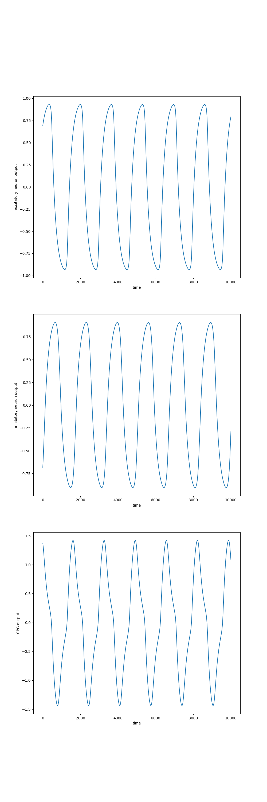
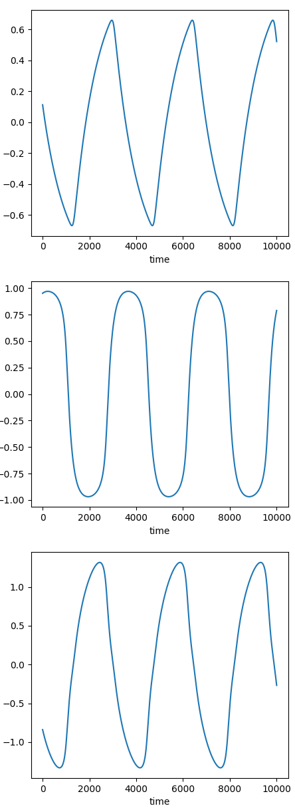
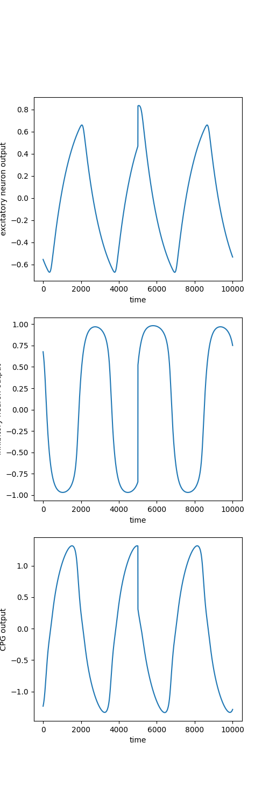
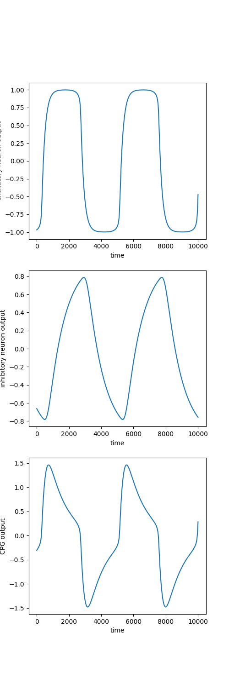

The following are the details of the experiments conducted with the Wilson-Cowan nervous oscillator model
# EXPERIMENT 1
This experiment involves testing the implmented model for a Wilson-Cowan nervous oscillator model consisting of only a single unit of the exitatory and inhibitory neuron pair.
The following are the values of the parameters used to obtain the plot
- a = 5.6
- b = 5.6
- c = 2.4
- d = -2.4
- Tu = 0.2
- Tv = 0.2
- Su = 0.02
- Sv = 0.02
- mu = 1
- f = tanh(x)

The following plot depicts the results of the experiment:

# EXPERIMENT 2
The following are the values of the parameters used to obtain the plot
- a = 5.6 
- b = 5.6 
- c = 2.4 
- d = -2.4
- Tu = 1 
- Tv = 0.2 
- Su = 0.02
- Sv = 0.02
- mu = 1 
- f = tanh(x)

The following plot depicts the results of the experiment:

# EXPERIMENT 3
This experiment is done to depict the ability of the Wilson-Cowan nervous oscillator model to return to the stable oscillations upon disturbance.
The following are the values of the parameters used to obtain the plot
- a = 5.6 
- b = 5.6 
- c = 2.4 
- d = -2.4
- Tu = 0.2 
- Tv = 0.2 
- Su = 0.02
- Sv = 0.02
- mu = 1  
- f = tanh(x)

The following plot depicts the results of the experiment:

# EXPERIMENT 4
The following are the values of the parameters used to obtain the plot
- a = 5.6 
- b = 5.6 
- c = 2.4 
- d = -2.4
- Tu = 0.2 
- Tv = 1 
- Su = 0.02
- Sv = 0.02
- mu = 1   
- f = tanh(x)

The following plot depicts the results of the experiment:

