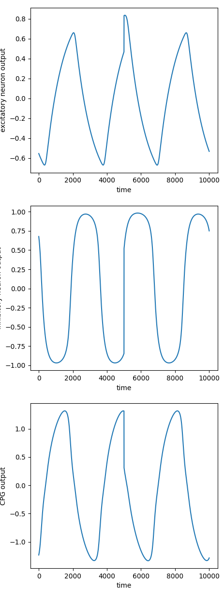
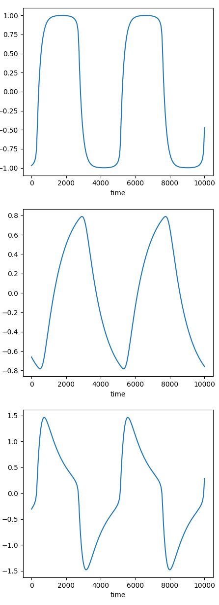
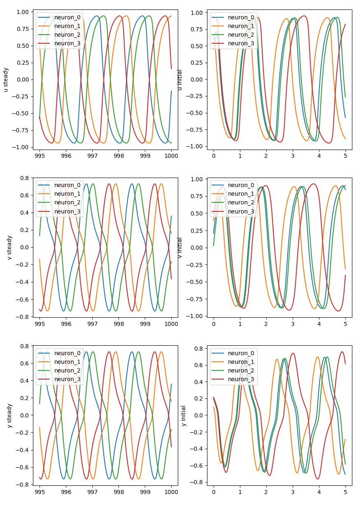
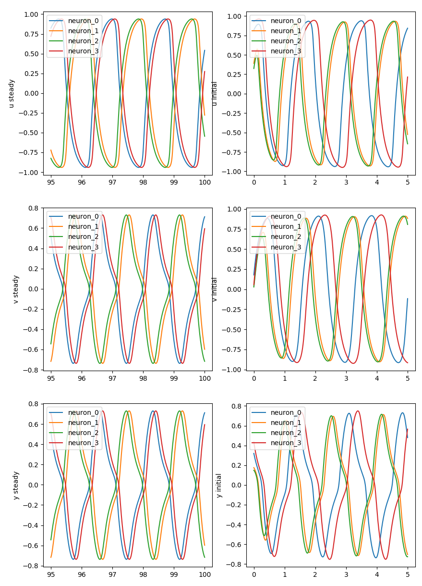
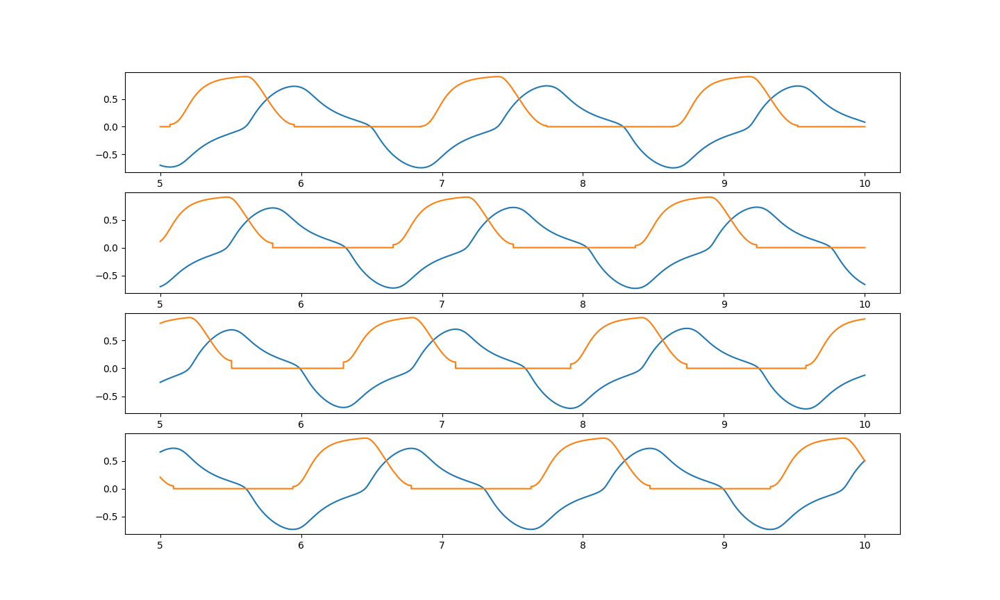

The following are the details of the experiments conducted with the Wilson-Cowan nervous oscillator model
Refer the following paper for more information about the implemented models-
[Gait Planning and Stability Control of a Quadruped Robot](https://www.hindawi.com/journals/cin/2016/9853070/)
# NEURON MODEL
## EXPERIMENT 1
This experiment involves testing the implmented model for a Wilson-Cowan nervous oscillator model consisting of only a single unit of the exitatory and inhibitory neuron pair.
The following are the values of the parameters used to obtain the plot
- a = 5.6
- b = 5.6
- c = 2.4
- d = -2.4
- Tu = 0.2
- Tv = 0.2
- Su = 0.02
- Sv = 0.02
- mu = 1
- f = tanh(x)

The following plot depicts the results of the experiment:

## EXPERIMENT 2
The following are the values of the parameters used to obtain the plot
- a = 5.6 
- b = 5.6 
- c = 2.4 
- d = -2.4
- Tu = 1 
- Tv = 0.2 
- Su = 0.02
- Sv = 0.02
- mu = 1 
- f = tanh(x)

The following plot depicts the results of the experiment:

## EXPERIMENT 3
This experiment is done to depict the ability of the Wilson-Cowan nervous oscillator model to return to the stable oscillations upon disturbance.
The following are the values of the parameters used to obtain the plot
- a = 5.6 
- b = 5.6 
- c = 2.4 
- d = -2.4
- Tu = 0.2 
- Tv = 0.2 
- Su = 0.02
- Sv = 0.02
- mu = 1  
- f = tanh(x)

The following plot depicts the results of the experiment:

## EXPERIMENT 4
The following are the values of the parameters used to obtain the plot
- a = 5.6 
- b = 5.6 
- c = 2.4 
- d = -2.4
- Tu = 0.2 
- Tv = 1 
- Su = 0.02
- Sv = 0.02
- mu = 1   
- f = tanh(x)

The following plot depicts the results of the experiment:

# CPG MODEL
The CPG Model is a fully connected neural network, with no self connections. Two types of connection matrices have been mentioned in the reference paper. 
Experiments performed for both the mentioned connection matrices and more.
## EXPERIMENT 5 
The following are the values of the parameters used to obtain the plot
All neuron models are similar
- a = 5.6 
- b = 5.6 
- c = 2.4 
- d = -2.4
- Tu = 0.2 
- Tv = 1 
- Su = 0.02
- Sv = 0.02
- mu = 1   
- f = tanh(x)
- W = walking gait connection matrix
- p = 0.5

The following plot depicts the results of the experiment:

# EXPERIMENT 6
The following are the values of the parameters used to obtain the plot
All neuron models are similar
- a = 5.6 
- b = 5.6 
- c = 2.4 
- d = -2.4
- Tu = 0.2 
- Tv = 1 
- Su = 0.02
- Sv = 0.02
- mu = 1   
- f = tanh(x)
- W = trotting gait connection matrix
- p = 0.5 

The following plot depicts the results of the experiment:

# EXPERIMENT 7
This experiment simulates the locomotion pattern generated by the proposed CPG in the paper. 
Base cpg from experiments 1 is used to compute the joint angles.

The following figure depict the obtain locomotion patterns

